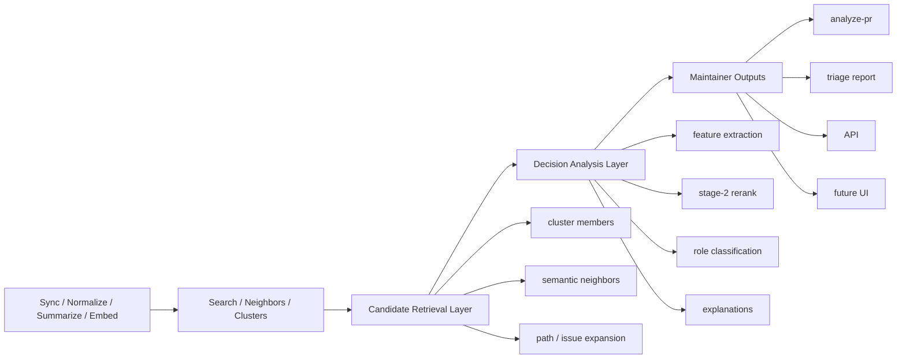

# Maintainer Decision Layer Roadmap

## Context

`ghcrawl` already does the hard part of local maintainer discovery:

- GitHub sync into local SQLite state
- canonical thread summaries
- embeddings and semantic neighbors
- deterministic cluster construction
- cluster summaries and detail views

That is enough to answer:

- which issues and PRs are about the same problem area
- which threads are near each other semantically

It is not yet enough to answer stronger maintainer questions such as:

- which PR is the best base to keep
- which nearby variant is probably superseded
- which neighbor is too weak or too noisy to promote

This document proposes a clean next layer for those questions without replacing the current cluster model.

## Problem

Today the main semantic model is:

- retrieve nearby threads
- materialize similarity edges
- build connected-component clusters
- expose cluster summaries and cluster detail

That is the right base, but it leaves a gap between similarity grouping and maintainer action.

`ghcrawl` can say:

- these items are related

It cannot yet say:

- start review here
- this is the strongest base
- this variant likely lost
- this neighbor is related but should stay excluded

## Target Shape

The next architecture step should be a reusable decision-analysis layer above retrieval and clustering.



The key idea is additive layering:

- keep the current search and cluster pipeline
- reuse current cluster and neighbor data as candidate recall
- add a second-stage maintainer decision pass
- expose that decision pass through one or more surfaces

## Layer Responsibilities

### Candidate Retrieval Layer

Purpose:

- collect a bounded candidate set around a seed thread

Inputs may include:

- cluster members
- semantic neighbors
- path-overlap candidates
- issue-linked candidates

This layer should optimize for recall, not for final ranking.

### Decision Analysis Layer

Purpose:

- score and classify the candidate set using maintainer-oriented signals

Expected signals:

- linked issue overlap
- changed-path relevance
- companion test relevance
- unrelated churn or noise penalty
- state and recency

This layer should optimize for maintainer usefulness, not for raw semantic similarity.

### Explanation Layer

Purpose:

- make the result auditable and operationally safe

Expected outputs:

- score breakdown by signal
- short explanation text
- reason codes
- decision trace

### Presentation Layer

Purpose:

- reuse the same analyzer core in different maintainer surfaces

Consumers should include:

- `ghcrawl analyze-pr`
- triage report generation
- local API responses
- future TUI or web views

## Proposed Initial Roles

The first decision-aware outputs should stay explicit and narrow:

- `best_base`
- `same_cluster_candidate`
- `superseded_candidate`
- `excluded_neighbor`

These roles are intentionally stronger than "same cluster" but weaker than a fully automated duplicate-close policy.

## Roadmap

### Phase 0: Fix Current Contracts

Make the existing maintainer surfaces safer before adding a new layer.

- soften over-claiming triage wording
- align report wording with real count semantics
- improve section-aware PR-template heuristics for edited tails
- keep current cluster storage work extensible for future decision metadata

### Phase 1: Introduce A Reusable Decision Core

Add a reusable analysis module, not just a command-specific heuristic bundle.

- seed thread in
- candidate set out of existing retrieval sources
- stage-two scoring
- explicit role classification
- explanation payload

This phase should not require storage redesign.

### Phase 2: Add `analyze-pr`

Expose the decision core through one focused CLI surface first.

Suggested command:

```bash
ghcrawl analyze-pr owner/repo --number 123 --json
```

Suggested output:

- chosen best base
- nearby alternatives
- superseded candidates
- excluded neighbors
- score breakdown and explanation metadata

### Phase 3: Reuse The Core In Triage And API

Once the core is stable:

- feed decision outputs into triage reports
- expose decision payloads through the local HTTP API
- let future UI surfaces render the same outputs

This prevents decision logic from being duplicated in each surface.

### Phase 4: Attach Decision Artifacts To Run State

After the decision model is useful and stable:

- attach decision metadata to cluster snapshots or adjacent run-state tables
- preserve explanation and lineage context across rebuilds
- make it easier to compare how maintainer recommendations evolve over time

This phase should build on the snapshot/current-view work rather than replace it.

### Phase 5: Evaluation And Feedback Loop

Turn the decision layer into a measured subsystem instead of a one-off feature.

- build a small labeled maintainer corpus
- add regression fixtures for best-base and superseded classification
- track false positives and false negatives
- tune thresholds and explanations using real maintainer review cases

## Relationship To Current Work

This roadmap is designed to fit current open work rather than compete with it.

- Cluster storage and lineage work remains the persistence foundation.
- Triage report work remains the reporting surface.
- PR-template heuristic work remains a deterministic maintainer signal.

The decision layer sits above those efforts and gives them a cleaner long-term destination.

## Non-Goals

- do not replace connected-component clustering
- do not redesign snapshot storage in the first iteration
- do not change embedding backends as part of this roadmap
- do not claim mathematically perfect duplicate adjudication
- do not force all maintainer logic into one giant command or report

## Why This Is Better

This roadmap keeps the architecture clean:

- retrieval stays retrieval
- decision logic stays reusable
- explanations stay first-class
- output surfaces stay thin

That gives `ghcrawl` a credible path from semantic grouping to maintainer decision support without turning every new feature into a special-case heuristic branch.
