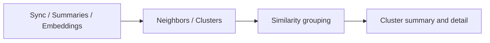
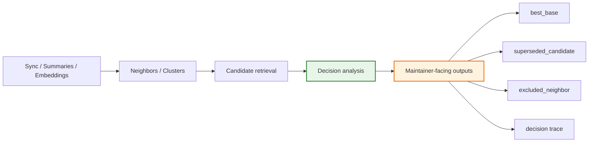
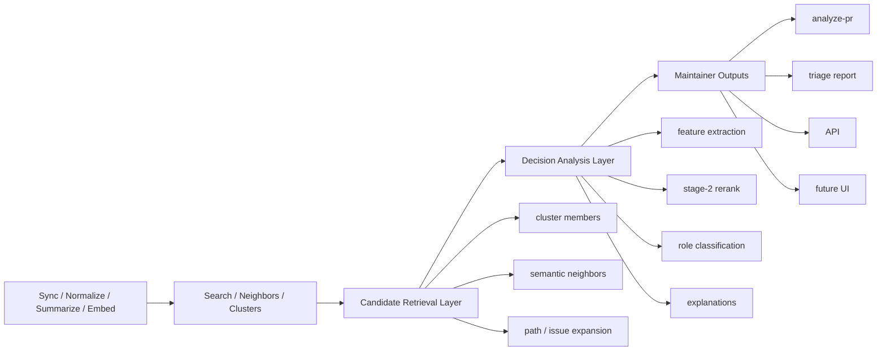
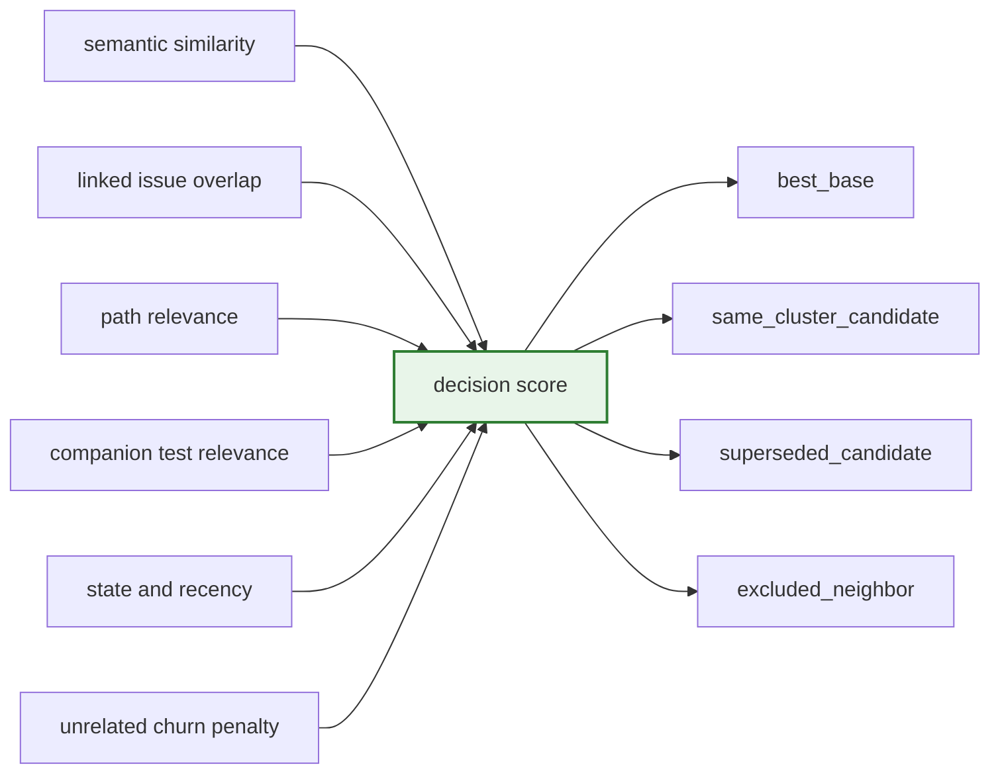
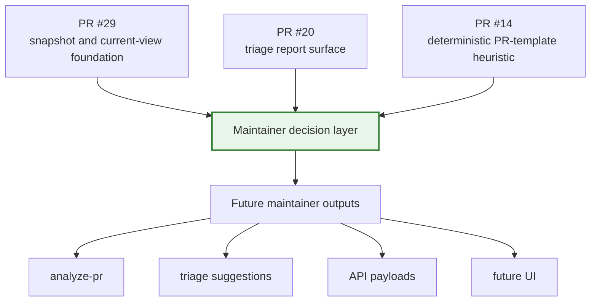
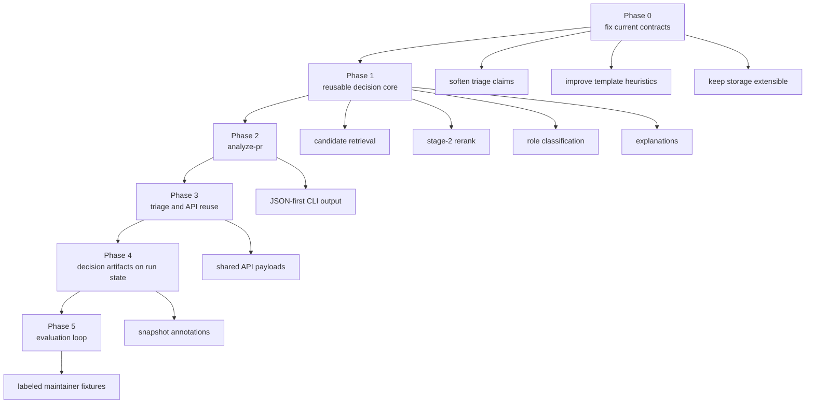

# Maintainer Decision Layer Roadmap

## Context

`ghcrawl` already does the hard part of local maintainer discovery:

- GitHub sync into local SQLite state
- canonical thread summaries
- embeddings and semantic neighbors
- deterministic cluster construction
- cluster summaries and detail views

That is enough to answer:

- which issues and PRs are about the same problem area
- which threads are near each other semantically

It is not yet enough to answer stronger maintainer questions such as:

- which PR is the best base to keep
- which nearby variant is probably superseded
- which neighbor is too weak or too noisy to promote

This document proposes a clean next layer for those questions without replacing the current cluster model.

## Problem

Today the main semantic model is:

- retrieve nearby threads
- materialize similarity edges
- build connected-component clusters
- expose cluster summaries and cluster detail

That is the right base, but it leaves a gap between similarity grouping and maintainer action.

`ghcrawl` can say:

- these items are related

It cannot yet say:

- start review here
- this is the strongest base
- this variant likely lost
- this neighbor is related but should stay excluded

## Current State vs Target State

The architectural gap is small but important.

Today, `ghcrawl` mainly stops at semantic grouping:



The proposed target keeps that pipeline and adds one reusable decision layer above it:



## Target Shape

The next architecture step should be a reusable decision-analysis layer above retrieval and clustering.



The key idea is additive layering:

- keep the current search and cluster pipeline
- reuse current cluster and neighbor data as candidate recall
- add a second-stage maintainer decision pass
- expose that decision pass through one or more surfaces

## Layer Responsibilities

### Candidate Retrieval Layer

Purpose:

- collect a bounded candidate set around a seed thread

Inputs may include:

- cluster members
- semantic neighbors
- path-overlap candidates
- issue-linked candidates

This layer should optimize for recall, not for final ranking.

The candidate set should preserve retrieval provenance explicitly, for example:

- `cluster_member`
- `semantic_neighbor`
- `path_overlap`
- `issue_linked`

Those are not decision outcomes. They are evidence about how a candidate entered the set.

### Decision Analysis Layer

Purpose:

- score and classify the candidate set using maintainer-oriented signals

Expected signals:

- linked issue overlap
- changed-path relevance
- companion test relevance
- unrelated churn or noise penalty
- state and recency

This layer should optimize for maintainer usefulness, not for raw semantic similarity.

## Initial Scoring Proposal

This is the part that should carry the main maintainer-facing value.

The first iteration should ship with an explicit score model instead of hiding the decision logic behind vague heuristics. The roadmap should be concrete about feature families and monotonic direction, but exact coefficients should live in code or config plus fixture-based evaluation.

There is already an existence proof for weighted stage-two scoring in `claw-maintainer-tui`. That implementation uses explicit weighted composition for semantic reranking and related maintainer decision heuristics in a live maintainer workflow. This roadmap should treat that as a reference implementation and starting point, rather than presenting one fixed coefficient set as universal truth for `ghcrawl`.



The important part is the composition:

- semantic similarity keeps the decision layer grounded in the current retrieval model
- linked issue overlap adds deterministic problem affinity
- path relevance rewards candidates that touch the same implementation area
- companion test relevance rewards candidates that validate the same fix surface
- state and recency give maintainers a slight operational preference
- unrelated churn penalty suppresses broad but noisy neighbors

One reasonable starting rule is:

- normalize each positive feature into a bounded local score
- normalize unrelated churn into a bounded penalty
- keep the exact weighting and thresholds in implementation config
- allow the first `ghcrawl` implementation to start from the `claw-maintainer-tui` weighting profile and then retune against `ghcrawl` fixtures
- tune those values against labeled fixtures before widening the feature set

## Feature Availability Boundary

The roadmap should be explicit about what the first iteration can use without hidden live fetches or ad hoc parsing.

### V1 default

V1 should be local-data-only by default.

That means the first implementation should prefer signals that are already cheap and local:

- semantic similarity
- retrieval provenance such as active-cluster membership or semantic-neighbor membership
- thread kind and thread state
- draft / merged / closed facts when locally available
- updated-at recency
- PR-template residue, if the PR-template heuristic lands

### Later feature providers

These are good targets, but should be treated as later feature providers unless they become first-class normalized local signals:

- rich linked-issue overlap
- changed-path relevance
- companion test relevance
- unrelated-churn metrics derived from structured diff data

This keeps the analyzer deterministic and stops V1 from quietly becoming a live GitHub fetch workflow.

## Seed And Candidate Contract

The core contract should separate retrieval provenance from decision outcome.

Suggested shape:

```ts
analyzeSeed(seedThreadId, opts) => {
  seed,
  activeClusterRunId,
  candidates: [
    {
      thread,
      retrievalSources: ["cluster_member", "semantic_neighbor"],
      features: {
        semanticSimilarity,
        inActiveCluster,
        isSemanticNeighbor,
        threadKind,
        threadState,
        updatedAt,
        templateResidue,
      },
      score,
      decisionRole,
      reasonCodes,
    },
  ],
  bestBaseThreadId,
}
```

This is the main contract boundary that future CLI, API, triage, and UI surfaces should share.

### Suggested Role Logic

The role assignment should stay explicit and rule-driven on top of the score model.

- retrieval provenance and decision role should remain separate fields
- role eligibility should depend on thread kind

- `best_base`
  - only valid for pull request candidates
  - highest non-excluded pull request after score and tie-break review
- `superseded_candidate`
  - only valid for pull request candidates
  - strong affinity but materially lower score than the best base, especially when coverage or validation is weaker
- `same_cluster_candidate`
  - valid for retained neighbors, but should not mean “won the decision”
- `excluded_neighbor`
  - semantic candidate is below the minimum affinity threshold, or the noise penalty dominates the score

Issues may still appear as candidates and evidence, but they should not compete for `best_base`.

This makes the decision layer stronger than raw cluster membership while still being auditable.

### Explanation Layer

Purpose:

- make the result auditable and operationally safe

Expected outputs:

- score breakdown by signal
- short explanation text
- reason codes
- decision trace

### Presentation Layer

Purpose:

- reuse the same analyzer core in different maintainer surfaces

Consumers should include:

- `ghcrawl analyze-pr`
- triage report generation
- local API responses
- future TUI or web views

## Current Work Fit

This proposal is designed to give the current open work a clearer long-term shape rather than competing with it.



## Proposed Initial Roles

The first decision-aware outputs should stay explicit and narrow:

- `best_base`
- `same_cluster_candidate`
- `superseded_candidate`
- `excluded_neighbor`

These roles are intentionally stronger than "same cluster" but weaker than a fully automated duplicate-close policy.

## Roadmap

### Phase 0: Fix Current Contracts

Make the existing maintainer surfaces safer before adding a new layer.

- soften over-claiming triage wording
- align report wording with real count semantics
- improve section-aware PR-template heuristics for edited tails
- keep current cluster storage work extensible for future decision metadata

### Phase 1: Introduce A Reusable Decision Core

Add a reusable analysis module, not just a command-specific heuristic bundle.

- seed thread in
- candidate set out of existing retrieval sources
- stage-two scoring
- explicit role classification
- explanation payload
- a tiny labeled fixture set for regression protection

This phase should not require storage redesign and should stay local-data-only by default.

### Phase 2: Add `analyze-pr`

Expose the decision core through one focused CLI surface first.

Suggested command:

```bash
ghcrawl analyze-pr owner/repo --number 123 --json
```

Suggested output:

- chosen best base
- nearby alternatives
- superseded candidates
- excluded neighbors
- score breakdown and explanation metadata

### Phase 3: Reuse The Core In Triage And API

Once the core is stable:

- feed decision outputs into triage reports
- expose decision payloads through the local HTTP API
- let future UI surfaces render the same outputs

This prevents decision logic from being duplicated in each surface.

### Phase 4: Attach Decision Artifacts To Run State

After the decision model is useful and stable:

- persist results in adjacent `decision_runs` or `decision_candidates` style tables
- preserve explanation and lineage context across rebuilds
- make it easier to compare how maintainer recommendations evolve over time

This phase should build on the snapshot/current-view work rather than replace it, and should stay decoupled from cluster snapshots themselves.

### Phase 5: Evaluation And Feedback Loop

Turn the decision layer into a measured subsystem instead of a one-off feature.

- build a small labeled maintainer corpus
- add regression fixtures for best-base and superseded classification
- track false positives and false negatives
- tune thresholds and explanations using real maintainer review cases

## Delivery Sequence

The intended delivery path is incremental rather than rewrite-oriented.



## Relationship To Current Work

This roadmap is designed to fit current open work rather than compete with it.

- Cluster storage and lineage work remains the persistence foundation.
- Triage report work remains the reporting surface.
- PR-template heuristic work remains a deterministic maintainer signal.

The decision layer sits above those efforts and gives them a cleaner long-term destination.

## Non-Goals

- do not replace connected-component clustering
- do not redesign snapshot storage in the first iteration
- do not change embedding backends as part of this roadmap
- do not claim mathematically perfect duplicate adjudication
- do not force all maintainer logic into one giant command or report

## Why This Is Better

This roadmap keeps the architecture clean:

- retrieval stays retrieval
- decision logic stays reusable
- explanations stay first-class
- output surfaces stay thin

That gives `ghcrawl` a credible path from semantic grouping to maintainer decision support without turning every new feature into a special-case heuristic branch.
